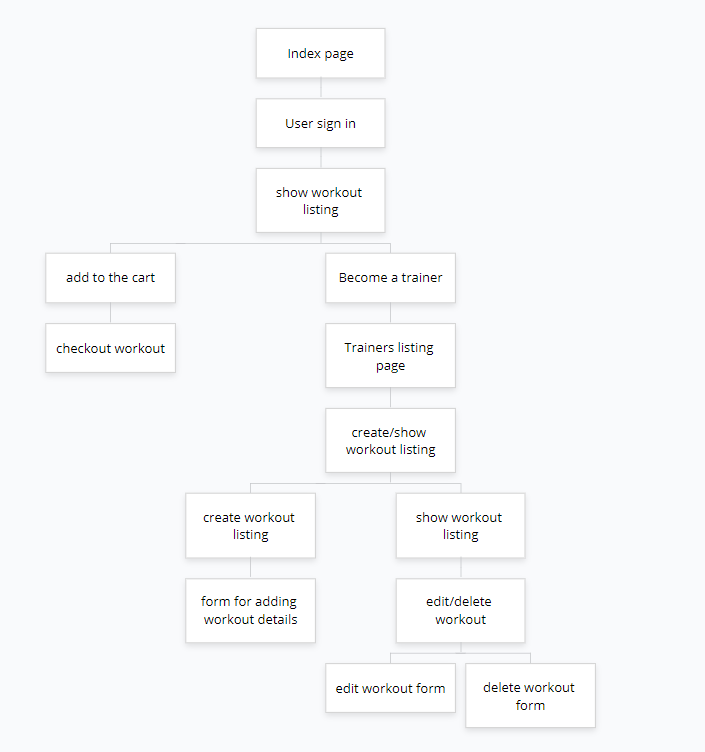
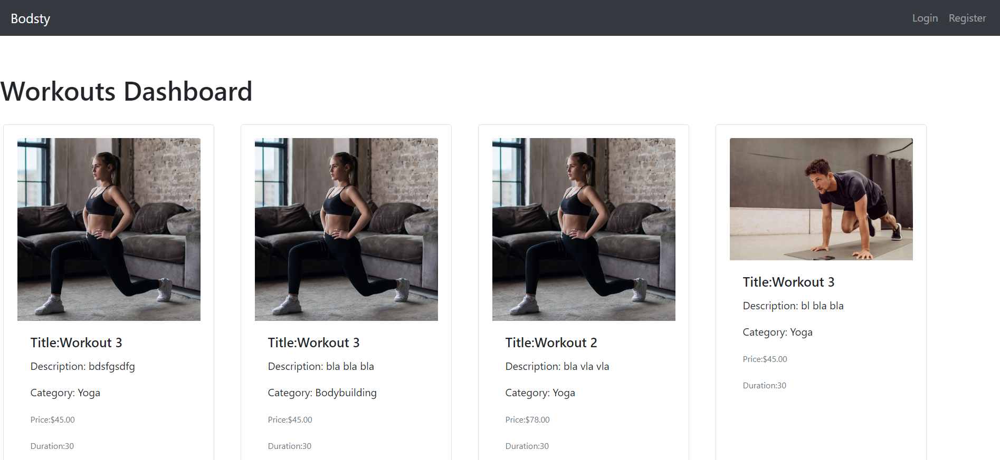
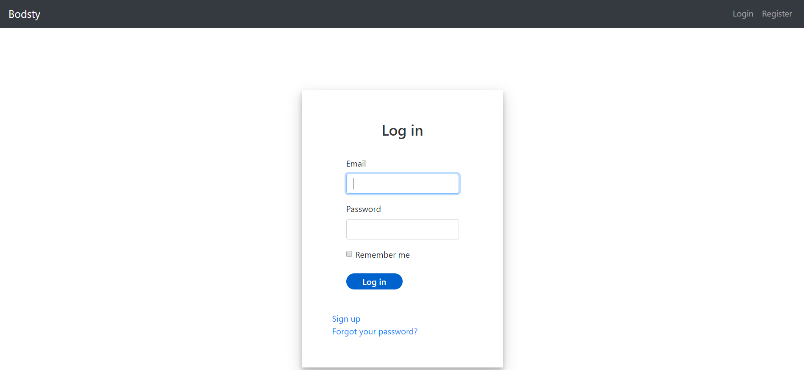
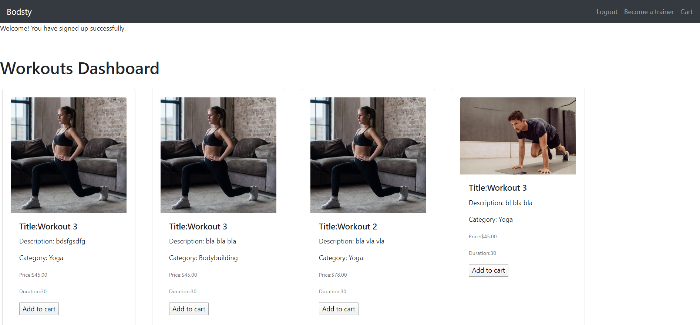
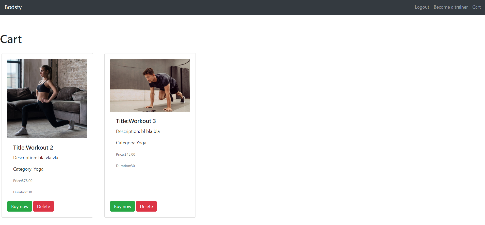
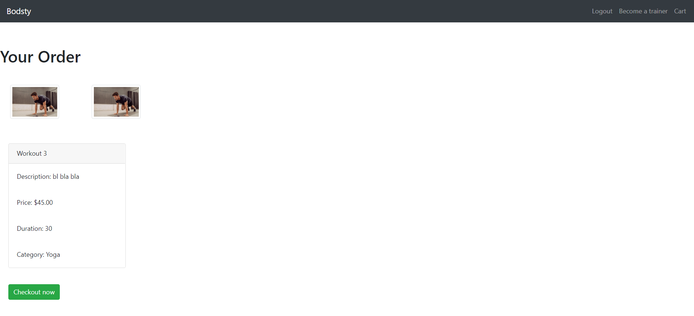
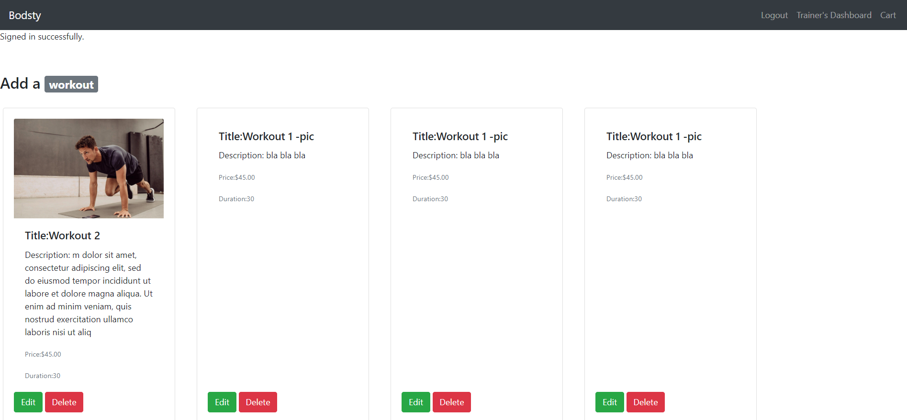
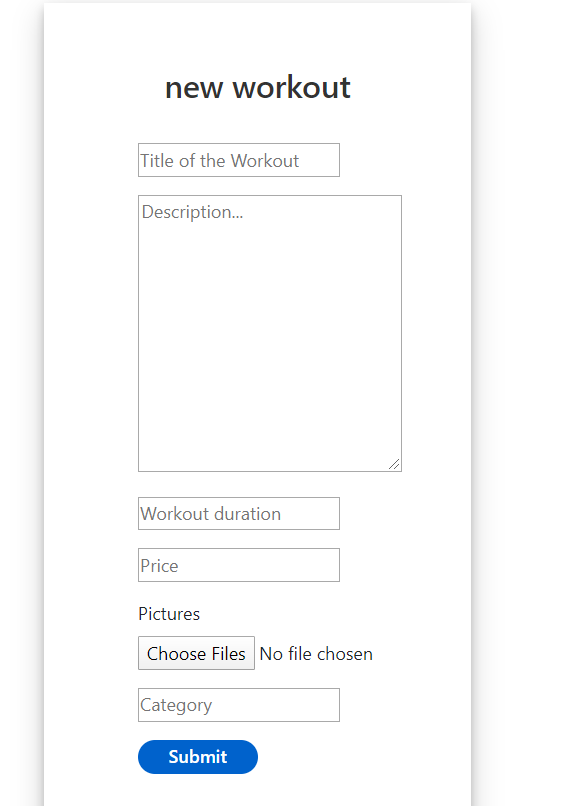
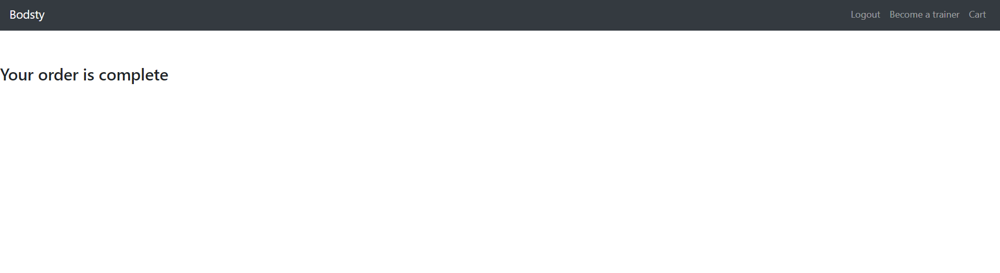
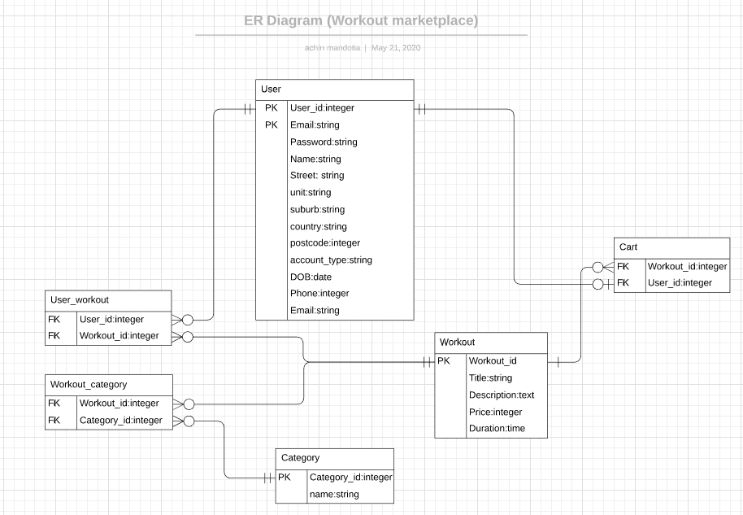

# Bodsty - Marketplace application


### R7. Identification of the problem solved by building this particular marketplace app.

Bodtsy is a marketplace application created to provide a common platform for fitness trainers to sell curated workouts to people. It is a marketplace application to sell workouts.

### R8. Why is it a problem that needs solving?
There are many platforms that one can go to for workouts, but usually they’re limited in their domain. Mostly people either go to a specific trainer’s site or have to buy a subscription service to look for workouts. Bodsty provide bridge between fitness trainers and people. It is a site where one can go to look for different workouts created by different fitness trainers in many categories, such as Yoga, Bodybuilding, Calisthenics, etc.

### R9. Link to the deployed application:
* [Bodsty](https://agile-bastion-16832.herokuapp.com/) - Live website

### R10. Link to the application's GitHub repository:
* [Github](https://github.com/achman1729/Bodtsy-marketplace) - Github link

### R11. Description of marketplace application
- Purpose - The purpose of the Bodsty marketplace application is to provide a common platform for many trainers who can’t afford a website or new to the industry and want to help people with their workouts.

- Functionality / features
    
    - A home page is set as Workouts Dashboard for visitors to look at the workouts but they will have to login to view the details and add to cart
    - once the user sign in, they can either buy a workout, or can choose to become a trainer.
    - if the user choose to become a trainer, they can add a workout and delete their workout.
    - if the user after signing in choose to buy a workout, they can add to the cart and proceed to checkout and payment
- Sitemap
* [Sitemap Link](https://www.gloomaps.com/oeaNV3x3WY)

* 

- Screenshots
1. Homepage

* 

2. User login page

* 

3. Homepage after login

* 

4. Cart page

* 

5. Buy now page

* 

6. Trainer's dashboard

* 

7. Create workout page

* 

8. edit workout page

* 

9. Page after payment completion

* 

- Target audience 
    
    - Anyone who want to train and get fit and looking for a workout
    - All the trainers who wants to share their workout

- Tech stack (e.g. html, css, deployment platform, etc)

    * Rails version 6.0.3
    * Ruby version 2.7.0
    * Postgresql (database management)
    * HTML 5
    * SCSS/CSS
    * Bootstrap (frontend styling)
    * Heroku (deployment platform)
    * Stripe (third party payment system)
    * Github (source control)
    * Adobe XD (wireframe mockups)
    * Unsplash (free stock images)
    * Trello.com (project management, user stories)
    * Lucid chart (Entity Relationship Diagram)
    * Keynote (Slide deck presentation)


### R12. Application User Stories

Trello Board User Stories [Link](https://trello.com/b/kFgMKjGW/marketplace-app)

### R14. Entity Relationship Diagram

* [Bodsty ERD](https://app.lucidchart.com/invitations/accept/55599e42-2b58-4024-9817-5c325990dec9)

* Screenshot
* 

### R15. Explain the different high-level components (abstractions) in your app
The application is built on MCV framework of Rails and Ruby language. The MVC used is explained below 

#### Model

- User model - stores all the information about user and has a flag column that helps recognize a user from a trainer. This model is auto generated while installing Devise and used for authentication as well

- Cart model - this is a join table between User model and Workouts model. It stores the workouts chosen by a user to buy.

- Category model - it stores the categories of a workout

- Workout model - it stores the details of the workout


#### View
 - cart view - It renders a show view to show all the workouts added to the cart by the user 

 - Devise view - It renders all the views related to authentication, sign in, sign up and password management

- order view - It renders views for a new order and completion/cancel of a order 

- trainers view - It renders a view to show a trainer their own created workouts

- users view - It renders view for making a user a trainer

- workout view - It renders views for a new workout to be created, a workout to be edited and showing all the workout on the homepage. 

#### Controller

- carts_controller - It has actions for adding a workout to the cart model

- orders_controller - It has actions for check out a workout and directing to payment gateway

- trainers_controller - It has actions for rendering workouts created by a trainer

- users_controller - It has actions for converting a user to a trainer

- workouts_controller - It has actions for creating, editing, showing and deleting a workout 

### R16. Detail any third party services that your app will use

* Heroku - https://dashboard.heroku.com/apps
* Devise gem - https://github.com/heartcombo/devise
* Stripe - https://stripe.com/au
* PostgreSQL - https://www.postgresql.org/

### R17. Describe your projects models in terms of the relationships (active record associations) they have with each other

- Cart model
    - belongs_to :user
    - belongs_to :workout

- Category model
    - has_many :workouts

- User model
    - has_many :carts
    - has_many :workouts

- Workout Model
    - has_many :users, through: :user_workouts
    - has_many :carts
    - has_many :categories


### R18. Discuss the database relations to be implemented in your application

The database relations are implemented in the following way in the schema

- active_storage_attachments - stores file attachments

- active_storage_blobs - stores filename, metadata, key and content type of an attachment

- carts - is a join table between user and workout and has user_id and workout_id

- categories - has name of the category

- user_workouts - is a join table between user and workouts and stores user_id and workout_id

- users - stores unique username, email and password(encrypted). It also stores user details such as name, address, etc.

- workouts - is a table to store details about workouts


### R19. Provide your database schema design</summary>

```ActiveRecord::Schema.define(version: 2020_05_17_232232) do

  # These are extensions that must be enabled in order to support this database
  enable_extension "plpgsql"

  create_table "active_storage_attachments", force: :cascade do |t|
    t.string "name", null: false
    t.string "record_type", null: false
    t.bigint "record_id", null: false
    t.bigint "blob_id", null: false
    t.datetime "created_at", null: false
    t.index ["blob_id"], name: "index_active_storage_attachments_on_blob_id"
    t.index ["record_type", "record_id", "name", "blob_id"], name: "index_active_storage_attachments_uniqueness", unique: true
  end

  create_table "active_storage_blobs", force: :cascade do |t|
    t.string "key", null: false
    t.string "filename", null: false
    t.string "content_type"
    t.text "metadata"
    t.bigint "byte_size", null: false
    t.string "checksum", null: false
    t.datetime "created_at", null: false
    t.index ["key"], name: "index_active_storage_blobs_on_key", unique: true
  end

  create_table "carts", force: :cascade do |t|
    t.bigint "user_id", null: false
    t.bigint "workout_id", null: false
    t.datetime "created_at", precision: 6, null: false
    t.datetime "updated_at", precision: 6, null: false
    t.integer "quantity"
    t.decimal "total"
    t.decimal "unit_price"
    t.index ["user_id"], name: "index_carts_on_user_id"
    t.index ["workout_id"], name: "index_carts_on_workout_id"
  end

  create_table "categories", force: :cascade do |t|
    t.string "name", null: false
    t.datetime "created_at", precision: 6, null: false
    t.datetime "updated_at", precision: 6, null: false
  end

  create_table "user_workouts", force: :cascade do |t|
    t.bigint "user_id", null: false
    t.bigint "workout_id", null: false
    t.datetime "created_at", precision: 6, null: false
    t.datetime "updated_at", precision: 6, null: false
    t.index ["user_id"], name: "index_user_workouts_on_user_id"
    t.index ["workout_id"], name: "index_user_workouts_on_workout_id"
  end

  create_table "users", force: :cascade do |t|
    t.string "email", default: "", null: false
    t.string "encrypted_password", default: "", null: false
    t.string "reset_password_token"
    t.datetime "reset_password_sent_at"
    t.datetime "remember_created_at"
    t.datetime "created_at", precision: 6, null: false
    t.datetime "updated_at", precision: 6, null: false
    t.string "first_name"
    t.string "last_name"
    t.integer "phone"
    t.string "street"
    t.string "suburb"
    t.string "state"
    t.string "country"
    t.integer "postcode"
    t.string "account_type"
    t.index ["email"], name: "index_users_on_email", unique: true
    t.index ["reset_password_token"], name: "index_users_on_reset_password_token", unique: true
  end

  create_table "workout_categories", force: :cascade do |t|
    t.bigint "workout_id", null: false
    t.bigint "category_id", null: false
    t.datetime "created_at", precision: 6, null: false
    t.datetime "updated_at", precision: 6, null: false
    t.index ["category_id"], name: "index_workout_categories_on_category_id"
    t.index ["workout_id"], name: "index_workout_categories_on_workout_id"
  end

  create_table "workouts", force: :cascade do |t|
    t.string "title", null: false
    t.text "description", null: false
    t.integer "price", null: false
    t.datetime "created_at", precision: 6, null: false
    t.datetime "updated_at", precision: 6, null: false
    t.integer "duration"
  end

  add_foreign_key "active_storage_attachments", "active_storage_blobs", column: "blob_id"
  add_foreign_key "carts", "users"
  add_foreign_key "carts", "workouts"
  add_foreign_key "user_workouts", "users"
  add_foreign_key "user_workouts", "workouts"
  add_foreign_key "workout_categories", "categories"
  add_foreign_key "workout_categories", "workouts"
end
```
### R20. Describe the way tasks are allocated and tracked in your project

The tasks were managed via, 
* Features required in the application - This is the required features (must have features) and optional features that are good to have in the application

* User stories - This helped with breaking down the implementation of the features that will be used by the user and seller. The tasks in these stories were described as actions that a User and a Seller can perform with this application.

* Todo - This is the list to breakdown the tasks required to fulfill the feature requirements and implementation of the user stories